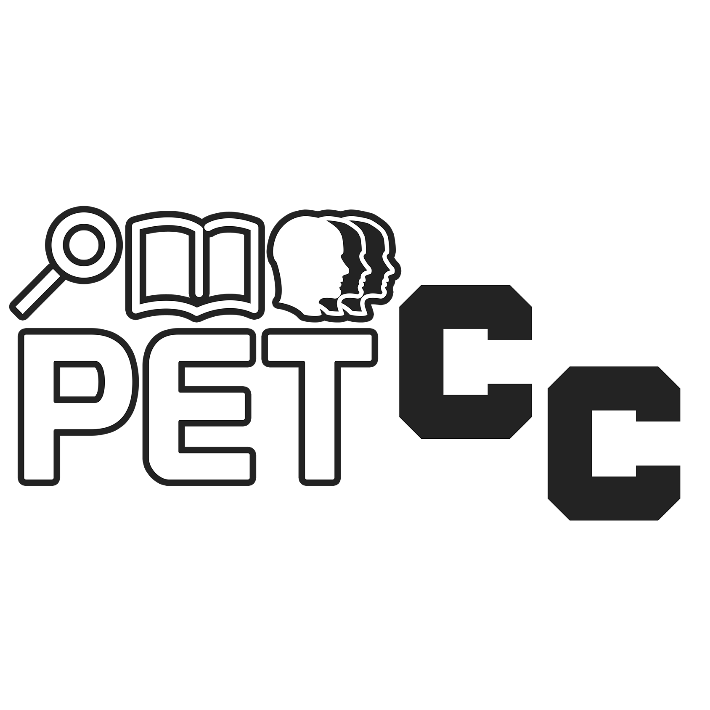

# Materiais do minicurso básico da linguagem R 
*Minicurso ofertado pelo PET-CC da Universidade Federal de Santa Maria*

 

## Ementa
1. Introdução à Linguagem R
2. Manipulação de Dados
3. Análise Exploratória de Dados
4. Visualização de Dados

## Referências
