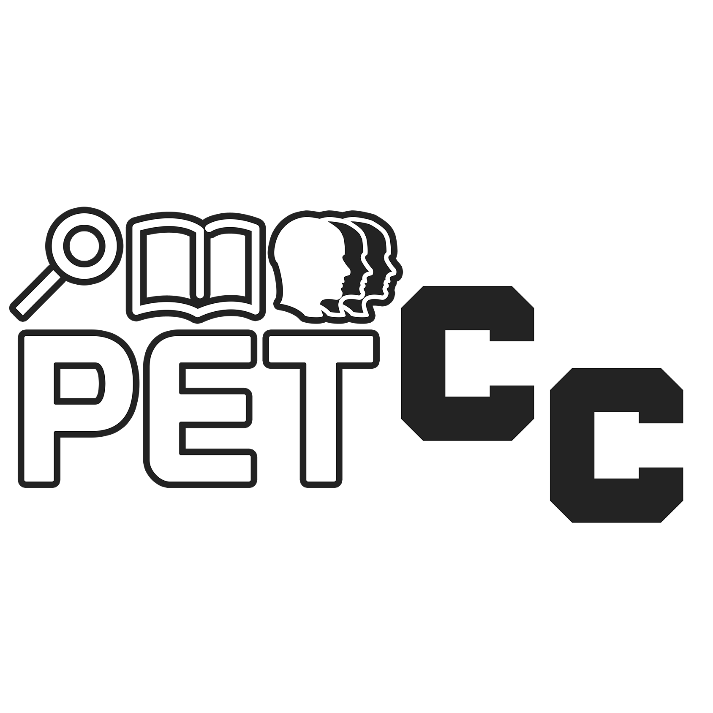
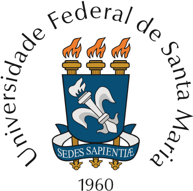

# Materiais do minicurso básico da linguagem R 
*Minicurso ofertado pelo PET-CC da Universidade Federal de Santa Maria*

<picture>
    <source srcset="Imagens/logo_pet.png"  media="(prefers-color-scheme: dark)" alt="Logo do programa PET-CC da UFSM" width="200">
    
</picture>
<picture>
    <source srcset="Imagens/logo_UFSM_dark_mode.png"  media="(prefers-color-scheme: dark)" alt="Logo da Universidade Federal de Santa Maria" width="200">
    
</picture>

## Materiais

|   Aula    |                            Arquivos                                            |
|----------|--------------------------------------------------------------------------------|
| 01       | [Slides](./Aulas/Aula01/Aula01.pdf) -  [Exercicios](./Aulas/Aula01/README.md)  |
| 02       | [Slides](./Aulas/Aula02/Aula02.pdf) -  [Exercicios](./Aulas/Aula02/Exercicios.md)  |
| 03       | [Slides](./Aulas/Aula03/Aula03.pdf) -  [Exercicios](./Aulas/Aula03/Exercicios.md)  |
| 04       | [Slides](./Aulas/Aula04/Aula04.pdf) -  [Exercicios](./Aulas/Aula04/Exercicios.md)  |
| Extra       | [Slides](./Aulas/AulaExtra/Aula01.pdf) -  [Exercicios](./Aulas/AulaExtra/Exercicios.md)  |

## Ementa

1. Introdução à Linguagem R
2. Manipulação de Dados
3. Análise Exploratória de Dados
4. Visualização de Dados

